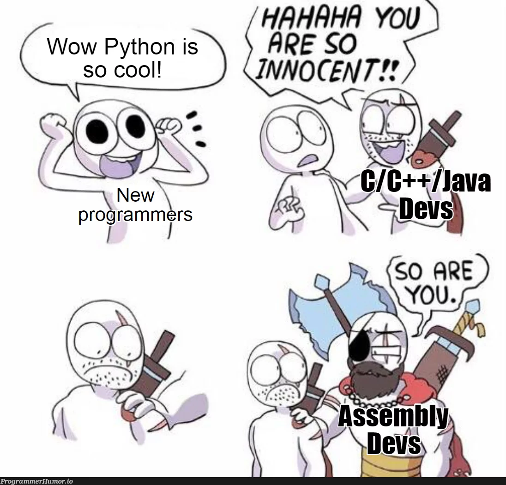

# Exercícios de Assembly

Os exercícios desse repositório são em Assembly para uma arquitetura MIPS(versão 32 bits).

#### "Programação em Assembly definida em um meme..."

##### *Se você se interessou e deseja ~~coringar~~ se aventurar e aprender mais sobre o MIPS, leia o capítulo 2, basta clicar no gif(sugestivo) abaixo:* 

